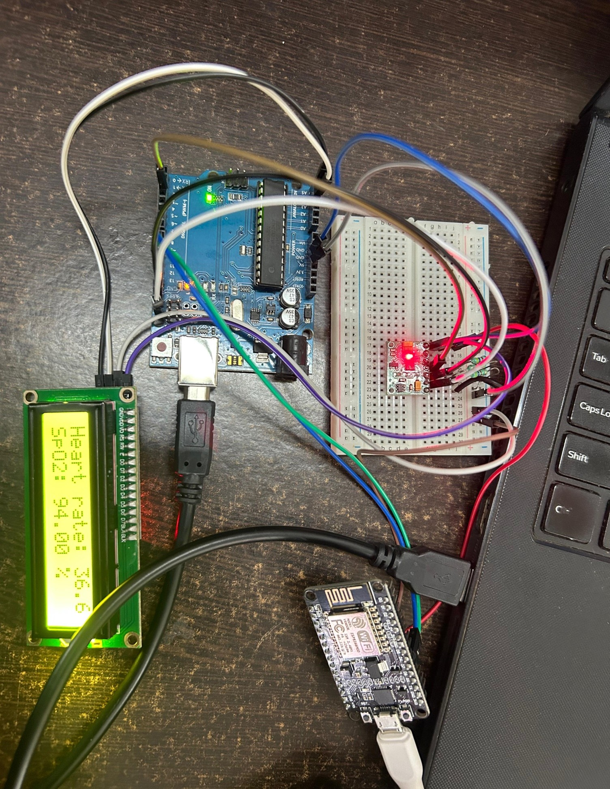

<!-- Project Logo -->

  
  
  

---

# MedWatch System

> **A wireless health monitoring system using Arduino, MAX30100 Pulse Oximeter, and ESP8266**

---

## 📁 Files
| File | Description |
|------|-------------|
| `sender-1.ino` | Arduino sketch for the sender device. Reads heart rate and SpO2 from the MAX30100 sensor and sends data via serial to the ESP8266. |
| `receiver.ino` | Arduino sketch for the receiver device. Receives data from the ESP8266 and prints it to the serial monitor. |
| `REPORT.MEDWATCHSYSTEM[1][1].pdf` | Project documentation. |
| `Circuit.jpg` | Circuit diagram for hardware setup. |

---

## 🚀 How to Use
1. Upload `sender-1.ino` to the Arduino connected to the MAX30100 and LCD.
2. Upload `receiver.ino` to the Arduino or ESP8266 acting as the receiver.
3. Connect the devices as per the circuit diagram below.
4. Open the serial monitor to view received data.

  

---

## 🛠️ Requirements
- **Arduino board**
- **MAX30100 Pulse Oximeter sensor**
- **ESP8266 WiFi module**
- **LCD display (I2C)**

---

## 📝 Notes
- Adjust pin numbers and addresses in the code as per your hardware.
- Refer to the PDF report and circuit image for more details.

---

  <b>Made with ❤️ for Health Monitoring Projects</b>

